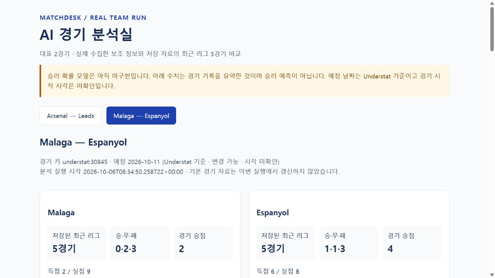

# MatchDesk — Evidence-based Football Agent Team

[English](README.md) | [한국어](README.ko.md)

A five-agent workflow for collecting football evidence, comparing teams, building a viewer, independently checking results, and issuing a final internal decision. Designed as an Agentic AI Fundamentals portfolio project. Current release: **0.2.1**.

## Current status

Agent definitions, portable skills, data validators, ownership/approval gates and an offline comparison viewer are implemented. An actual representative run covered Arsenal–Leeds and Malaga–Espanyol using the earlier ten-role arrangement. That run is preserved, not relabelled as a five-agent run. **Prediction models, automated refresh, a prediction API and a deployed service are not implemented.** Claude runtime execution and a fresh five-agent run have not been verified.



## Five agents

| Agent | Responsibilities |
|---|---|
| Director | Plan, assign, track operations, review evidence and issue a final internal decision |
| Research | Collect match/squad/formation/value evidence and recent team news |
| Analyst | Compare teams and develop/run future prediction models |
| Builder | Charts, viewer and eventual service integration |
| Reviewer | Independent data/calculation/UI verification and model evaluation |

Plan → research → analysis → optional presentation → independent review → director decision. The director does not author the work being approved. Reviewer and director must be distinct from authors and each other. Final business decisions remain with the human user.

## Start here

- [Current five-agent package](agent-team-integrated-2026-10-06-v01/README.md) and [team configuration](agent-team-integrated-2026-10-06-v01/team.json).
- [Preserved ten-role package](agent-team-2026-10-06-v01/README.md).
- [Actual run](team-run-2026-10-06-v01/README.md), [independent verification](team-run-2026-10-06-v01/validation/SPEC.md), [final decision](team-run-2026-10-06-v01/approval/decision.md).
- Download/open [the offline HTML viewer](team-run-2026-10-06-v01/visualization/index-v03.html). GitHub source view does not execute HTML.

## Local checks

Python 3.10+; the checks below use only the standard library. From this project directory:

```sh
python -m unittest discover -s agent-team-2026-10-06-v01/tests -v
python -m unittest discover -s agent-team-integrated-2026-10-06-v01/tests -v
python agent-team-integrated-2026-10-06-v01/tools/context_cli.py validate team-run-2026-10-06-v01/data/context_records.json
python agent-team-integrated-2026-10-06-v01/tools/context_cli.py validate team-run-2026-10-06-v01/trends/records.json
```

The archived configuration checks report 7 legacy tests and 6 integrated tests. The real run recorded 49 auxiliary entries: 26 collected, 22 missing and 1 blocked; 117 squad players and 44 previous starters. An independent saved-input comparison recorded 271 checks with no discrepancies. Analysis was internally approved for two fixtures; prediction and prediction-service modes were held. These are evidence-scope checks, not certification of every provider fact. The bundled skill YAML validator could not run locally because PyYAML was unavailable; a narrower scalar/reference check was recorded instead.

## Data and forecasting policy

Planned league scope: PL and LaLiga, 2023/24–2025/26 plus elapsed 2026/27. Understat supplies core results, dates and xG; StatMuse supplies non-overlapping season statistics. No official-date overrides, Football-Data, odds or Champions League are included in the selected scope. Future fixtures are prediction targets. Historical training inputs must contain only information available before each historical match; actual outcomes are labels. Unannounced future lineups are not a mandatory blocker for a basic model.

Only a **20-completed/2-scheduled-fixture demonstration subset** is included here, not a full training corpus. Full website caches and machine-specific execution scripts remain local. Public run evidence is a sanitized export; original independent-verification source files are not all redistributable in this package. Transfermarkt values are June 1 estimates, squad snapshots are from October, some news dates are inferred, and complete availability/transfer/rest-day coverage is missing. Unconfirmed kickoff times stay unconfirmed.

## Versions and reproducibility

[VERSION](VERSION), [release history](CHANGELOG.md), [version policy](docs/VERSIONING.md) and [file hashes](publication_manifest.json) identify each snapshot. Provider/model names are not hardcoded. Each package contains canonical skills plus Codex and Claude copies; runtime capability determines actual delegation. A shared contract is not evidence of successful execution on every provider.

Portfolio strengths are source reconciliation, explicit missingness, temporal correctness, independent review and traceable decisions. Next development work is a time-aware baseline model, evaluation, automated refresh and service integration.
